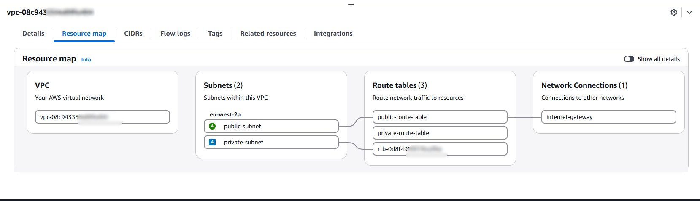
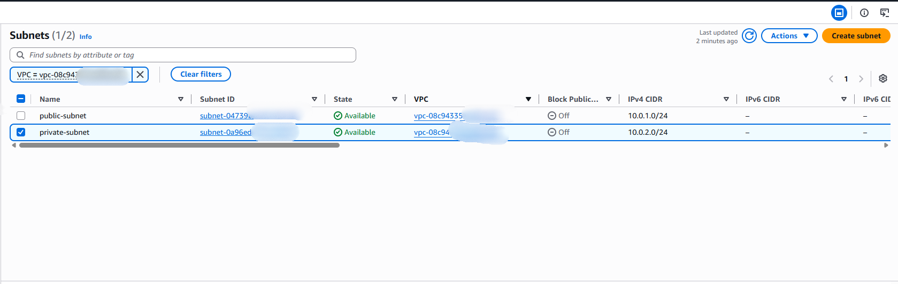
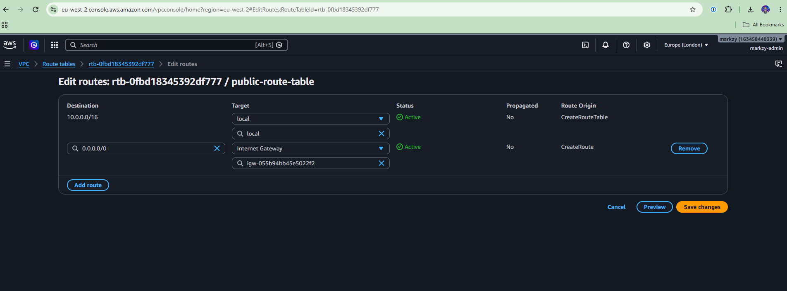
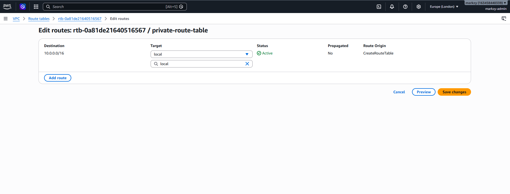
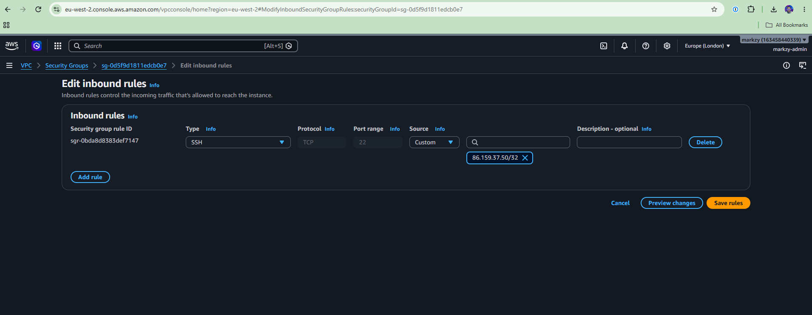

# Secure AWS Infrastructure Deployment with Terraform

## Objective

This project documents the design, deployment, testing, and security of a small AWS network environment.

The current goal is to understand how traffic moves through a VPC, how public and private subnets differ, how routing and security controls affect connectivity, and how an EC2 instance communicates with the internet.

The environment is being built and tested manually first so that each AWS component is understood before the same infrastructure is codified with Terraform in the second stage of the project.

**Terraform is Stage Two of this project and has not begun yet.**

---

## Region

### AWS Region: `eu-west-2` — London

The London region was selected to keep project resources within a UK AWS region and align the environment with UK data-residency considerations.

---

## Current Architecture

The environment currently contains:

- VPC: `10.0.0.0/16`
- Public subnet: `10.0.1.0/24`
- Private subnet: `10.0.2.0/24`
- One Availability Zone
- Internet Gateway
- Separate public and private route tables
- One Ubuntu EC2 instance in the public subnet
- Security Group controlling access to the EC2 instance
- EC2 Instance Metadata Service configured to require IMDSv2
- Metadata response hop limit set to `1`
- One S3 bucket in `eu-west-2`
- S3 Block Public Access enabled
- S3 Versioning enabled
- S3 default encryption using `SSE-S3`





---

### Public Subnet

The public subnet has the default route:

```text
0.0.0.0/0 → Internet Gateway
```



---

### Private Subnet

The private subnet does not have a route to the Internet Gateway and currently contains no resources.



---

### EC2 Instance

The EC2 instance has the private address:

```text
10.0.1.6/24
```

and an AWS-assigned public IPv4 address used for internet connectivity.

The public IPv4 address is not configured directly on the Linux network interface.

---

### Security Group

**Inbound:** TCP `22` is permitted from a single source address as a `/32`.

No other inbound rules are configured. The source address is redacted in the screenshot below.

**Outbound:** all traffic is currently permitted to `0.0.0.0/0`.

This is the AWS default and has not yet been restricted. It is required in the current build for commands such as `apt update` to reach Ubuntu package repositories.



---

### EC2 Metadata Security

The EC2 instance requires **IMDSv2** for metadata access.

Testing confirmed that:

- a tokenless request to `169.254.169.254` returned `401 Unauthorized`
- an IMDSv2 token could be obtained successfully
- the token could then be used to retrieve instance metadata
- the metadata response hop limit is set to `1`

The hop limit of `1` restricts metadata responses to a single network hop.

Full IMDSv2 evidence is recorded in [`docs/evidence.md`](docs/evidence.md).

---

### S3 Security Controls

An S3 bucket has been created in `eu-west-2` with the following controls:

- Block Public Access enabled
- Versioning enabled
- Default server-side encryption using Amazon S3 managed keys (`SSE-S3`)

Versioning was tested by:

1. uploading a file
2. modifying its contents
3. uploading it again using the same object key
4. confirming that both versions remained stored
5. downloading the non-current version
6. confirming that the original content was successfully recovered

Anonymous access was also tested using an unsigned `curl` request and returned:

```text
HTTP/1.1 403 Forbidden
AccessDenied
```

A public bucket policy using:

```json
"Principal": "*"
```

was rejected at save time.

Further evidence, including encryption, versioning, recovery, Block Public Access, and anonymous-access testing, is recorded in [`docs/evidence.md`](docs/evidence.md).

---

## Internet Packet Path

Internet connectivity was tested successfully using:

```bash
sudo apt update
```

This demonstrated that the EC2 instance could reach Ubuntu package repositories through the public subnet.

---

## Outbound Path

When the EC2 instance initiates a connection to an internet destination, the traffic follows this path:

```text
Application
    ↓
Linux network stack
    ↓
EC2 private IP: 10.0.1.6
    ↓
Elastic Network Interface (ENI)
    ↓
Security Group enforcement
    ↓
VPC routing decision
    ↓
Public subnet route table
    ↓
0.0.0.0/0 → Internet Gateway
    ↓
Internet Gateway
    ↓
Private IPv4 address translated to the instance's public IPv4 address
    ↓
Internet
    ↓
Destination server
```

The EC2 instance itself only has its private address configured on its network interface.

The public IPv4 address does not appear on the Linux interface.

The Internet Gateway handles the translation between the instance's private IPv4 address and its assigned public IPv4 address for internet traffic.

---

## Return Path

The response follows the reverse path:

```text
Destination server
    ↓
Internet
    ↓
EC2 public IPv4 address
    ↓
Internet Gateway
    ↓
Public IPv4 address translated back to 10.0.1.6
    ↓
VPC routing
    ↓
Elastic Network Interface (ENI)
    ↓
Security Group state check
    ↓
Linux network stack
    ↓
Application
```

Security Groups are stateful, so return traffic for a connection initiated by the EC2 instance is automatically allowed.

---

### Route-Table Validation Test

The importance of the public subnet's default route was tested by temporarily removing:

```text
0.0.0.0/0 → Internet Gateway
```

Before the test, SSH connectivity was confirmed as working.

After the route was removed:

- new SSH connections timed out
- the already-established SSH session became unusable
- restoring the route restored SSH connectivity

The original prediction that SSH would time out was confirmed.

However, the original explanation for the failure was corrected during the investigation. The failure was not simply because an inbound SYN could not reach the instance. The missing route prevented the instance from sending internet-bound return traffic through the Internet Gateway, so the TCP handshake could not complete.

This demonstrated that:

```text
Public IPv4 address
        +
Internet Gateway
        +
Security Group allowing SSH
```

are not sufficient on their own.

The subnet also requires a working route:

```text
0.0.0.0/0 → Internet Gateway
```

for internet traffic to have a valid return path.

The full experiment, including the original hypothesis, observed behaviour, root cause, and correction, is documented in [`docs/troubleshooting-log.md`](docs/troubleshooting-log.md).

---

## Planned Extensions

The following have not yet been implemented:

- Enable AWS CloudTrail
- Evaluate enabling S3 MFA Delete to add protection against permanent deletion of object versions
- Review and restrict Security Group outbound traffic instead of retaining unrestricted `0.0.0.0/0` egress
- Complete the non-public S3 bucket-policy control test and remove the temporary policy afterwards
- Introduce Terraform
- Store Terraform state locally during the first Terraform implementation
- Recreate the existing AWS infrastructure using Terraform
- Test `terraform init`, `fmt`, `validate`, `plan`, `apply`, and `destroy`
- Add a private EC2 instance reachable only from the public instance
- Demonstrate segmentation without introducing a NAT Gateway
- Add GitHub Actions for Terraform validation
- Add Infrastructure as Code security scanning
- Improve Terraform state management after the local-state workflow is understood
