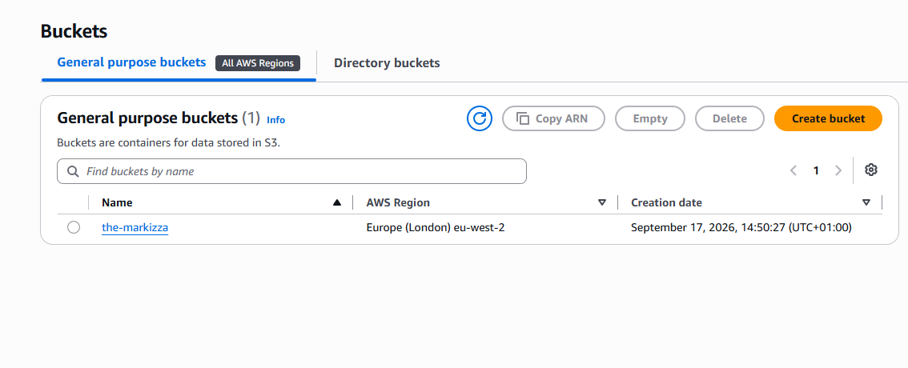
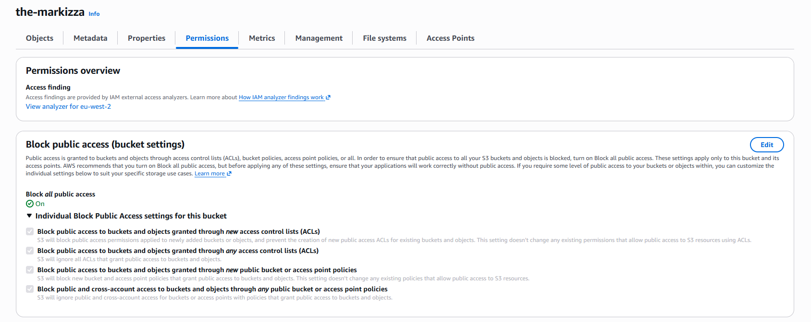
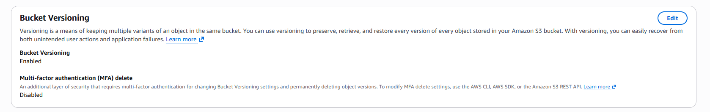
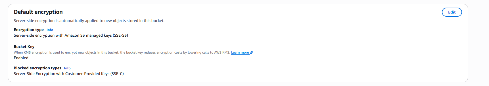
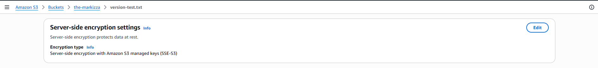
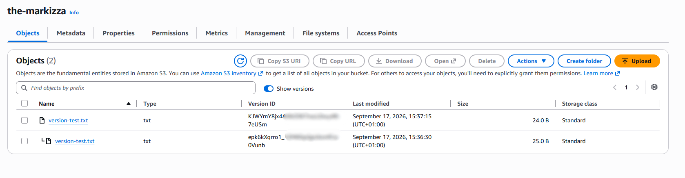
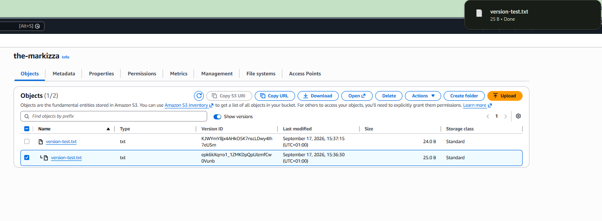
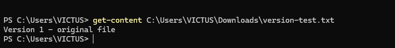
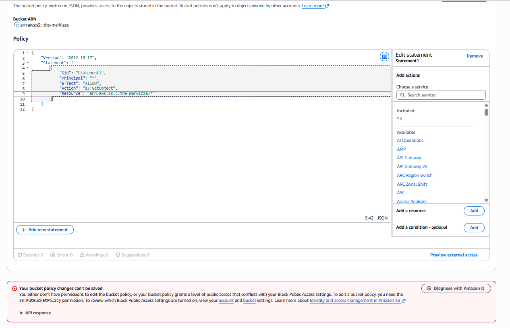

# Project Evidence
## 1. Successful SSH Connection

This proves that the EC2 instance is reachable over SSH using the correct Ubuntu username and private key.
```
PS C:\Users\VICTUS> ssh -i "$HOME\.ssh\aws-lab-eu-west-2.pem" ubuntu@[PUBLIC-IP-REDACTED]
Welcome to Ubuntu 24.04.4 LTS (GNU/Linux 6.17.0-1017-aws x86_64)
ubuntu@ip-10-0-1-6:~$
```
## 2. SSH Authentication Failure with the Wrong Username

This proves that TCP connectivity reached the host and the SSH service responded, but authentication failed because the EC2 Name tag was used as the login username instead of the Ubuntu AMI's default user.
```
PS C:\Users\VICTUS> ssh -i "$HOME\.ssh\aws-lab-eu-west-2.pem" secure-aws-tf-web-01-dev@[PUBLIC-IP-REDACTED]
The authenticity of host '[PUBLIC-IP-REDACTED] ([PUBLIC-IP-REDACTED])' can't be established.
ED25519 key fingerprint is SHA256:s/2gnY7o/rFClEYC3e60DHkjH5drNhE0hTFCX6rK154.
This key is not known by any other names.
Are you sure you want to continue connecting (yes/no/[fingerprint])? yes
Warning: Permanently added '[PUBLIC-IP-REDACTED]' (ED25519) to the list of known hosts.
secure-aws-tf-web-01-dev@[PUBLIC-IP-REDACTED]: Permission denied (publickey).
```
## 3. Internet Connectivity from the Public EC2 Instance

This proves that the instance can reach Ubuntu package repositories through the public subnet's internet route.
```
ubuntu@ip-10-0-1-6:~$ sudo apt update
Hit:1 http://eu-west-2.ec2.archive.ubuntu.com/ubuntu noble InRelease
Get:2 http://eu-west-2.ec2.archive.ubuntu.com/ubuntu noble-updates InRelease [126 kB]
Get:3 http://eu-west-2.ec2.archive.ubuntu.com/ubuntu noble-backports InRelease [126 kB]
[... output trimmed ...]
Fetched 36.9 MB in 6s (6247 kB/s)
Reading package lists... Done
Building dependency tree... Done
Reading state information... Done
143 packages can be upgraded. Run 'apt list --upgradable' to see them.
```
## 4. Private Network Interface and Public-IP NAT Behaviour

This proves that the EC2 instance holds only its private 10.0.1.6/24 address on ens5; the public IPv4 address is not configured on the instance itself because the Internet Gateway performs one-to-one NAT between the public address and the instance's private address.
```
ubuntu@ip-10-0-1-6:~$ ip addr show
1: lo: <LOOPBACK,UP,LOWER_UP> mtu 65536 qdisc noqueue state UNKNOWN group default qlen 1000
    link/loopback 00:00:00:00:00:00 brd 00:00:00:00:00:00
    inet 127.0.0.1/8 scope host lo
       valid_lft forever preferred_lft forever
    inet6 ::1/128 scope host noprefixroute
       valid_lft forever preferred_lft forever

2: ens5: <BROADCAST,MULTICAST,UP,LOWER_UP> mtu 9001 qdisc mq state UP group default qlen 1000
    link/ether 06:f1:73:6d:d6:4d brd ff:ff:ff:ff:ff:ff
    altname enp0s5
    inet 10.0.1.6/24 metric 100 brd 10.0.1.255 scope global dynamic ens5
       valid_lft 2443sec preferred_lft 2443sec
    inet6 fe80::4f1:73ff:fe6d:d64d/64 scope link
       valid_lft forever preferred_lft forever
```

## 5. IMDSv2 Enforcement

### 5a — IMDSv1 Blocked

This proves that the EC2 instance metadata service is reachable, but a metadata request without an IMDSv2 token is actively rejected with `401 Unauthorized`.

```text
ubuntu@ip-10-0-1-6:~$ curl -v http://169.254.169.254/
*   Trying 169.254.169.254:80...
* Connected to 169.254.169.254 (169.254.169.254) port 80
> GET / HTTP/1.1
> Host: 169.254.169.254
> User-Agent: curl/8.5.0
> Accept: */*
>
< HTTP/1.1 401 Unauthorized
< Content-Length: 0
< Date: Thu, 17 Sep 2026 12:35:34 GMT
< Server: EC2ws
< Connection: close
< Content-Type: text/plain
<
* Closing connection
```

The successful connection to `169.254.169.254:80` shows that the metadata service is reachable, while the `401 Unauthorized` response with `Content-Length: 0` shows that the tokenless request was actively refused rather than failing because the service was unreachable.

### 5b — IMDSv2 Token Flow Succeeds

This proves that an IMDSv2 session token can be obtained and successfully used to access EC2 instance metadata.

```text
ubuntu@ip-10-0-1-6:~$ TOKEN=`curl -X PUT "http://169.254.169.254/latest/api/token" -H "X-aws-ec2-metadata-token-ttl-seconds: 21600"`
  % Total    % Received % Xferd  Average Speed   Time    Time     Time  Current
                                 Dload  Upload   Total   Spent    Left  Speed
100    56  100    56    0     0  37308      0 --:--:-- --:--:-- --:--:-- 56000
ubuntu@ip-10-0-1-6:~$ curl -H "X-aws-ec2-metadata-token: $TOKEN" http://169.254.169.254/latest/meta-data/
ami-id
ami-launch-index
ami-manifest-path
block-device-mapping/
events/
hostname
identity-credentials/
instance-action
instance-id
instance-life-cycle
instance-type
local-hostname
local-ipv4
mac
metrics/
network/
placement/
profile
public-hostname
public-ipv4
public-keys/
reservation-id
security-groups
services/
ubuntu@ip-10-0-1-6:~$ curl -H "X-aws-ec2-metadata-token: $TOKEN" http://169.254.169.254/latest/meta-data/instance-id
[INSTANCE-ID-REDACTED]@ip-10-0-1-6:~$
```

Together, `5a` and `5b` demonstrate that **IMDSv2 is enforced**: tokenless metadata access is rejected with `401 Unauthorized`, while the token-based IMDSv2 workflow succeeds.

# Project Evidence

This file records evidence collected while building, testing, and securing the `secure-aws-terraform-infrastructure` project.

Only controls and behaviours that have been directly tested are recorded as confirmed.

---

## 1. Successful SSH Connection

This proves that the EC2 instance is reachable over SSH using the correct Ubuntu username and private key.

```text
PS C:\Users\VICTUS> ssh -i "$HOME\.ssh\aws-lab-eu-west-2.pem" ubuntu@[PUBLIC-IP-REDACTED]
Welcome to Ubuntu 24.04.4 LTS (GNU/Linux 6.17.0-1017-aws x86_64)
ubuntu@ip-10-0-1-6:~$
```

---

## 2. SSH Authentication Failure with the Wrong Username

This proves that TCP connectivity reached the host and the SSH service responded, but authentication failed because the EC2 Name tag was used as the login username instead of the Ubuntu AMI's default user.

```text
PS C:\Users\VICTUS> ssh -i "$HOME\.ssh\aws-lab-eu-west-2.pem" secure-aws-tf-web-01-dev@[PUBLIC-IP-REDACTED]
The authenticity of host '[PUBLIC-IP-REDACTED] ([PUBLIC-IP-REDACTED])' can't be established.
ED25519 key fingerprint is SHA256:s/2gnY7o/rFClEYC3e60DHkjH5drNhE0hTFCX6rK154.
This key is not known by any other names.
Are you sure you want to continue connecting (yes/no/[fingerprint])? yes
Warning: Permanently added '[PUBLIC-IP-REDACTED]' (ED25519) to the list of known hosts.
secure-aws-tf-web-01-dev@[PUBLIC-IP-REDACTED]: Permission denied (publickey).
```

---

## 3. Internet Connectivity from the Public EC2 Instance

This proves that the EC2 instance can reach Ubuntu package repositories through the public subnet's internet route.

```text
ubuntu@ip-10-0-1-6:~$ sudo apt update
Hit:1 http://eu-west-2.ec2.archive.ubuntu.com/ubuntu noble InRelease
Get:2 http://eu-west-2.ec2.archive.ubuntu.com/ubuntu noble-updates InRelease [126 kB]
Get:3 http://eu-west-2.ec2.archive.ubuntu.com/ubuntu noble-backports InRelease [126 kB]
.
.
.
Fetched 36.9 MB in 6s (6247 kB/s)
Reading package lists... Done
Building dependency tree... Done
Reading state information... Done
143 packages can be upgraded. Run 'apt list --upgradable' to see them.
```

---

## 4. Private Network Interface and Public-IP NAT Behaviour

This proves that the EC2 instance holds its private `10.0.1.6/24` address on `ens5` and does not have the assigned public IPv4 address configured directly on its Linux network interface.

```text
ubuntu@ip-10-0-1-6:~$ ip addr show
1: lo: <LOOPBACK,UP,LOWER_UP> mtu 65536 qdisc noqueue state UNKNOWN group default qlen 1000
    link/loopback 00:00:00:00:00:00 brd 00:00:00:00:00:00
    inet 127.0.0.1/8 scope host lo
       valid_lft forever preferred_lft forever
    inet6 ::1/128 scope host noprefixroute
       valid_lft forever preferred_lft forever
2: ens5: <BROADCAST,MULTICAST,UP,LOWER_UP> mtu 9001 qdisc mq state UP group default qlen 1000
    link/ether 06:f1:73:6d:d6:4d brd ff:ff:ff:ff:ff:ff
    altname enp0s5
    inet 10.0.1.6/24 metric 100 brd 10.0.1.255 scope global dynamic ens5
       valid_lft 2443sec preferred_lft 2443sec
    inet6 fe80::4f1:73ff:fe6d:d64d/64 scope link
       valid_lft forever preferred_lft forever
```

The instance only sees its private IPv4 address. For IPv4 internet communication, the Internet Gateway performs the translation between the instance's private IPv4 address and its assigned public IPv4 address.

---

## 5. IMDSv2 Enforcement

### 5a — IMDSv1 Blocked

This proves that the EC2 Instance Metadata Service is reachable, but a metadata request without an IMDSv2 token is actively rejected with `401 Unauthorized`.

```text
ubuntu@ip-10-0-1-6:~$ curl -v http://169.254.169.254/
*   Trying 169.254.169.254:80...
* Connected to 169.254.169.254 (169.254.169.254) port 80
> GET / HTTP/1.1
> Host: 169.254.169.254
> User-Agent: curl/8.5.0
> Accept: */*
>
< HTTP/1.1 401 Unauthorized
< Content-Length: 0
< Date: Thu, 17 Sep 2026 12:35:34 GMT
< Server: EC2ws
< Connection: close
< Content-Type: text/plain
<
* Closing connection
```

The successful connection to `169.254.169.254:80` proves that the metadata service is reachable.

The `401 Unauthorized` response with `Content-Length: 0` shows that the tokenless request was actively refused rather than failing because the service was unreachable.

### 5b — IMDSv2 Token Flow Succeeds

This proves that an IMDSv2 session token can be obtained and successfully used to access EC2 instance metadata.

```text
ubuntu@ip-10-0-1-6:~$ TOKEN=`curl -X PUT "http://169.254.169.254/latest/api/token" -H "X-aws-ec2-metadata-token-ttl-seconds: 21600"`
  % Total    % Received % Xferd  Average Speed   Time    Time     Time  Current
                                 Dload  Upload   Total   Spent    Left  Speed
100    56  100    56    0     0  37308      0 --:--:-- --:--:-- --:--:-- 56000
ubuntu@ip-10-0-1-6:~$ curl -H "X-aws-ec2-metadata-token: $TOKEN" http://169.254.169.254/latest/meta-data/
ami-id
ami-launch-index
ami-manifest-path
block-device-mapping/
events/
hostname
identity-credentials/
instance-action
instance-id
instance-life-cycle
instance-type
local-hostname
local-ipv4
mac
metrics/
network/
placement/
profile
public-hostname
public-ipv4
public-keys/
reservation-id
security-groups
services/
systemubuntu@ip-10-0-1-6:~$ cat ami-id
cat: ami-id: No such file or directory
ubuntu@ip-10-0-1-6:~$ curl -H "X-aws-ec2-metadata-token: $TOKEN" http://169.254.169.254/latest/meta-data/instance-id
[INSTANCE-ID-REDACTED]@ip-10-0-1-6:~$
```

Together, `5a` and `5b` demonstrate that IMDSv2 is enforced: tokenless metadata access is rejected, while the token-based IMDSv2 workflow succeeds.

### Console Configuration Record

The EC2 metadata options were changed through **Modify instance metadata options** so that IMDSv2 is required.

- **IMDSv2:** `Required`
- **Metadata response hop limit:** `1`

---

## 6. S3 Bucket Security Controls

The S3 bucket `the-markizza` was created in `eu-west-2` with Block Public Access, versioning, and default server-side encryption enabled.

### 6a — Bucket Created

The bucket was created successfully in the London AWS Region.



- **Bucket:** `the-markizza`
- **Region:** `Europe (London) eu-west-2`
- **Creation date:** `September 17, 2026, 14:50:27 (UTC+01:00)`

### 6b — Block Public Access Verified

Block Public Access was verified after bucket creation rather than relying only on the creation configuration.



**Block all public access:** `On`

The four individual controls are enabled.

#### ACL Controls

- `BlockPublicAcls` — blocks new public ACLs from being added to buckets or objects.
- `IgnorePublicAcls` — prevents existing public ACL permissions from granting public access.

#### Bucket Policy Controls

- `BlockPublicPolicy` — prevents new bucket or access-point policies that grant public access.
- `RestrictPublicBuckets` — restricts public and cross-account access through public bucket or access-point policies.

All four controls were enabled at the time of testing.

### 6c — Versioning Verified

Bucket versioning is enabled.



- **Bucket Versioning:** `Enabled`
- **MFA Delete:** `Disabled`

MFA Delete adds an additional protection layer around destructive versioning operations. When enabled, changing the bucket's versioning state or permanently deleting object versions requires authentication using the AWS account root user's MFA device.

**Status:** `Out of scope for the current project stage`

MFA Delete is not required to demonstrate basic S3 versioning and recoverability, so it has not been enabled during this stage of the project.

### 6d — Default Encryption Verified

The bucket uses server-side encryption with Amazon S3 managed keys.

**Encryption algorithm:** `SSE-S3`



`SSE-S3` was chosen instead of `SSE-KMS` for this stage because the project requires encryption at rest without introducing additional KMS key-management complexity or KMS request costs.

Object-level verification confirms that encryption was applied to the uploaded object itself rather than only configured as a bucket default.



The object `version-test.txt` shows:

```text
Encryption type:
Server-side encryption with Amazon S3 managed keys (SSE-S3)
```

### 6e — Versioning Proven by Behaviour

The first version of `version-test.txt` was uploaded.

The local working file was then changed to contain the Version 2 content and uploaded again using the same object key:

`version-test.txt`

The original upload was made from:

`C:\Users\VICTUS\Desktop`



Two separate object versions were retained:

```text
Object key: version-test.txt

Current version:
Version ID: [REDACTED]
Last modified: September 17, 2026, 15:37:15 (UTC+01:00)
Size: 24.0 B

Previous version:
Version ID: [REDACTED]
Last modified: September 17, 2026, 15:36:30 (UTC+01:00)
Size: 25.0 B
```

The later version at `15:37:15` is the current version.

The earlier version at `15:36:30` remains stored under the same object key.

This proves that uploading modified content using an existing object key creates a new version rather than replacing the previous version.

#### Retrieval of the Non-Current Version

The older version of `version-test.txt` was selected from the S3 version history and downloaded successfully.



The selected non-current version was:

- **Object key:** `version-test.txt`
- **Last modified:** `September 17, 2026, 15:36:30 (UTC+01:00)`
- **Size:** `25.0 B`
- **Status:** `Non-current version`

The local working copy had already been changed to contain the Version 2 content before the second upload.

The version recovered from S3 was downloaded to:

```text
C:\Users\VICTUS\Downloads\version-test.txt
```

The recovered file was then read using PowerShell:

```powershell
PS C:\Users\VICTUS> get-content C:\Users\VICTUS\Downloads\version-test.txt
Version 1 - original file
PS C:\Users\VICTUS>
```



The recovered content is the original Version 1 content rather than the modified Version 2 content.

The downloaded object's `25.0 B` size also matches the non-current object version shown in S3.

This confirms that S3 Versioning preserved the previous object version and that the non-current version remained recoverable after the same object key was overwritten.

**Result:** `Confirmed`

Versioning demonstrated both:

- retention of multiple versions under the same object key
- successful recovery of a previous version

### 6f — Public Access Refused

#### 6f(i) — Anonymous GET with No Public Policy

An anonymous HTTP request was made directly to the object's S3 URL without AWS authentication credentials.

```text
ubuntu@ip-10-0-1-6:~$ curl -v https://the-markizza.s3.eu-west-2.amazonaws.com/version-test.txt
* Host the-markizza.s3.eu-west-2.amazonaws.com:443 was resolved.
* IPv6: (none)
* IPv4: 3.5.246.122, 52.95.142.6, 52.95.143.110, 3.5.245.40, 3.5.245.255, 52.95.149.146, 3.5.245.235, 52.95.150.114
*   Trying 3.5.246.122:443...
* Connected to the-markizza.s3.eu-west-2.amazonaws.com (3.5.246.122) port 443
* ALPN: curl offers h2,http/1.1
* TLSv1.3 (OUT), TLS handshake, Client hello (1):
*  CAfile: /etc/ssl/certs/ca-certificates.crt
*  CApath: /etc/ssl/certs
* TLSv1.3 (IN), TLS handshake, Server hello (2):
* TLSv1.3 (IN), TLS handshake, Encrypted Extensions (8):
* TLSv1.3 (IN), TLS handshake, Certificate (11):
* TLSv1.3 (IN), TLS handshake, CERT verify (15):
* TLSv1.3 (IN), TLS handshake, Finished (20):
* TLSv1.3 (OUT), TLS change cipher, Change cipher spec (1):
* TLSv1.3 (OUT), TLS handshake, Finished (20):
* SSL connection using TLSv1.3 / TLS_AES_128_GCM_SHA256 / X25519 / RSASSA-PSS
* ALPN: server accepted http/1.1
* Server certificate:
*  subject: CN=*.s3.eu-west-2.amazonaws.com
*  start date: Nov 17 00:00:00 2025 GMT
*  expire date: Nov  4 23:59:59 2026 GMT
*  subjectAltName: host "the-markizza.s3.eu-west-2.amazonaws.com" matched cert's "*.s3.eu-west-2.amazonaws.com"
*  issuer: C=US; O=Amazon; CN=Amazon RSA 2048 M04
*  SSL certificate verify ok.
*   Certificate level 0: Public key type RSA (2048/112 Bits/secBits), signed using sha256WithRSAEncryption
*   Certificate level 1: Public key type RSA (2048/112 Bits/secBits), signed using sha256WithRSAEncryption
*   Certificate level 2: Public key type RSA (2048/112 Bits/secBits), signed using sha256WithRSAEncryption
* using HTTP/1.x
> GET /version-test.txt HTTP/1.1
> Host: the-markizza.s3.eu-west-2.amazonaws.com
> User-Agent: curl/8.5.0
> Accept: */*
>
< HTTP/1.1 403 Forbidden
< x-amz-request-id: DJR89NBGQPWZEN5X
< x-amz-id-2: 6DTYQ1zd3sVH3eNyxiJ0TP+EQsgrnDFePuY2P3x+wgb8l72XkMFfiJ5AgOpbwCgUstDozalhoii1Tsi5wgKt72TxpvLJj+33
< Content-Type: application/xml
< Transfer-Encoding: chunked
< Date: Fri, 18 Sep 2026 12:59:17 GMT
< Server: AmazonS3
<
<?xml version="1.0" encoding="UTF-8"?>
* Connection #0 to host the-markizza.s3.eu-west-2.amazonaws.com left intact
<Error><Code>AccessDenied</Code><Message>Access Denied</Message><RequestId>DJR89NBGQPWZEN5X</RequestId><HostId>6DTYQ1zd3sVH3eNyxiJ0TP+EQsgrnDFePuY2P3x+wgb8l72XkMFfiJ5AgOpbwCgUstDozalhoii1Tsi5wgKt72TxpvLJj+33</HostId></Error>ubuntu@ip-10-0-1-6:~$
```

The request successfully reached Amazon S3 over HTTPS and S3 returned:

```text
HTTP/1.1 403 Forbidden
<Error>
    <Code>AccessDenied</Code>
    <Message>Access Denied</Message>
</Error>
```

This demonstrates that S3 received the anonymous request and made an authorisation decision.

A timeout, DNS failure, or TLS failure would not demonstrate that an access-control decision had been made.

This confirms **default-deny behaviour** for the anonymous request.

It does **not**, by itself, prove Block Public Access precedence because there was no public bucket policy granting anonymous access at this stage.

The same request would also be denied on a bucket without Block Public Access if no policy or ACL granted anonymous access.

The request is anonymous even though it was issued from an EC2 instance because the `curl` request contains no AWS Signature Version 4 authentication, presigned URL, or other AWS authorisation credentials.

#### 6f(ii) — Public Bucket Policy Rejected at Save Time

A bucket policy was prepared that attempted to grant anonymous users permission to retrieve objects:

```json
{
  "Version": "2012-10-17",
  "Statement": [
    {
      "Sid": "Statement1",
      "Principal": "*",
      "Effect": "Allow",
      "Action": "s3:GetObject",
      "Resource": "arn:aws:s3:::the-markizza/*"
    }
  ]
}
```



The AWS console displayed:

> **Your bucket policy changes can't be saved**
>
> You either don't have permissions to edit the bucket policy, or your bucket policy grants a level of public access that conflicts with your Block Public Access settings. To edit a bucket policy, you need the `s3:PutBucketPolicy` permission. To review which Block Public Access settings are turned on, view your account and bucket settings.

**Observed result:** the public policy was not saved.

The console error lists two possible causes:

- insufficient `s3:PutBucketPolicy` permission
- conflict with Block Public Access

This evidence therefore proves that the attempted public policy did not come into existence, but does not by itself attribute the rejection specifically to Block Public Access.

### 6g — Post-Test State

The environment was returned to a secure state after the completed tests.

- **Bucket Versioning:** `Enabled`
- **Default encryption:** `SSE-S3`
- **Block Public Access:** all four settings enabled
- **Anonymous GET:** `403 AccessDenied`
- **Public bucket policy:** not present
- **Object versions retained:** two versions of `version-test.txt`
- **Previous object version:** successfully recovered
- **MFA Delete:** `Disabled` and currently out of scope
- **EC2 instance:** `Stopped`

The attempted public bucket policy did not need to be removed because the save operation was rejected and the policy never came into existence.
